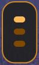
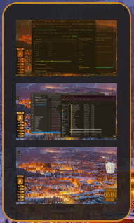

.. image:: https://github.com/2bndy5/UbubtuWorkspaces_Rainmeter_Skin/actions/workflows/AVscan.yml/badge.svg
    :target: https://github.com/2bndy5/UbubtuWorkspaces_Rainmeter_Skin/actions/workflows/AVscan.yml

.. image:: https://github.com/2bndy5/UbubtuWorkspaces_Rainmeter_Skin/actions/workflows/build.yml/badge.svg
    :target: https://github.com/2bndy5/UbubtuWorkspaces_Rainmeter_Skin/actions/workflows/build.yml

.. image:: https://img.shields.io/github/v/release/rainmeter/rainmeter?label=Rainmeter&style=plastic&logo=data:image/svg+xml;base64,PHN2ZyB4bWxucz0iaHR0cDovL3d3dy53My5vcmcvMjAwMC9zdmciIHZpZXdCb3g9IjAgMCA2LjM1IDYuMzUiIGhlaWdodD0iMjQiIHdpZHRoPSIyNCI+PHRleHQgeT0iNi4zNSIgc3R5bGU9ImxpbmUtaGVpZ2h0OjEuMjU7LWlua3NjYXBlLWZvbnQtc3BlY2lmaWNhdGlvbjonU2Vnb2UgTURMMiBBc3NldHMnIiBmb250LXNpemU9IjYuMzUiIGZvbnQtZmFtaWx5PSJTZWdvZSBNREwyIEFzc2V0cyIgZmlsbD0iI2ZmZiIgc3Ryb2tlLXdpZHRoPSIuMjY1Ij48dHNwYW4geT0iNi4zNSIgeD0iMCI+7q2CPC90c3Bhbj48L3RleHQ+PC9zdmc+
    :alt: Rainmeter Required (latest stable)
    :target: https://github.com/rainmeter/rainmeter/releases/latest

.. image:: https://img.shields.io/github/license/2bndy5/UbubtuWorkspaces_Rainmeter_Skin?color=blue&style=plastic&logo=data:image/svg%2bxml;base64,PHN2ZyB4bWxucz0iaHR0cDovL3d3dy53My5vcmcvMjAwMC9zdmciIHZpZXdCb3g9IjAgMCAyNCAyNCI+PGRlZnM+PHBhdGggaWQ9ImIiIGQ9Ik0tMTUuMzc0IDgzLjUwOWg0Ni42NDZ2NDAuMTgyaC00Ni42NDZ6Ii8+PHBhdGggaWQ9ImEiIGQ9Ik0tNy44NjIgOTcuMzExaDI5Ljg3NVYxMTguOEgtNy44NjJ6Ii8+PC9kZWZzPjx0ZXh0IHk9IjI0IiBzdHlsZT0ibGluZS1oZWlnaHQ6MS4yNTstaW5rc2NhcGUtZm9udC1zcGVjaWZpY2F0aW9uOidTZWdvZSBNREwyIEFzc2V0cyciIGZvbnQtc2l6ZT0iMjQiIGZvbnQtZmFtaWx5PSJTZWdvZSBNREwyIEFzc2V0cyIgZmlsbD0iI2ZmZiIgc3Ryb2tlLXdpZHRoPSIuMjgxIj48dHNwYW4geT0iMjQiIHg9IjAiPu6GkjwvdHNwYW4+PC90ZXh0Pjwvc3ZnPg==
    :alt: license
    :target: https://github.com/2bndy5/UbubtuWorkspaces_Rainmeter_Skin/blob/master/LICENSE

UbubtuWorkspaces
################

This is the home for developing UbubtuWorkspaces, a Rainmeter skin to display Windows Virtual Desktops in a panel similar to a GNOME Desktop plugin.

**Minimized**

**Maximized**

Features
~~~~~~~~

- Uses Windows theme color automatically
- The animation can be disabled leaving the panel in a minimized/maximized state
- Grabs a screenshot of the currently active Virtual Desktop every 2 seconds (for thumbnail preview in maximized state)
- The mouse scroll wheel can be used to switch between Virtual Desktops when mouse is hovering over the skin
- Customize the maximum/minimum size of desktop selectors (as a percentage in the ``[max/min]ThumbRatio`` variables)

Rainmeter required
##################

The minimum required version of Rainmeter is 4.5.0.17, but the `latest stable release <https://www.rainmeter.net>`_ is recommended.

Additional requirements
~~~~~~~~~~~~~~~~~~~~~~~

This skin uses the `RadAd's VirtualDesktop Rainmeter plugin <https://github.com/RadAd/RMVirtualDesktop>`_.
Thus, this skin ships with a copy of the `RadAd/RMVirtualDesktop v1.3.2 release <https://github.com/RadAd/RMVirtualDesktop/releases/tag/v1.3.2>`_.

Package Installer
#################

`This repository's releases <https://github.com/
2bndy5/UbubtuWorkspaces_Rainmeter_Skin/
releases>`_ include a Rainmeter package file called
``UbubtuWorkspaces_<version>.rmskin``. Open this file
with Rainmeter, follow the prompts, and the packaged files will be
copied/installed appropriately to your Rainmeter skins folder.

Manual Install
##############

Download this repository's zip file and extract the folder
``UbubtuWorkspaces`` (located in ``Skins``
folder) into the Rainmeter skins folder (defualts to
``C:\Users\%USERNAME%\Documents\Rainmeter\skins`` -
unless onedrive manages your user documents folder). If
installing a Rainmeter layout, the aforementioned
`Package Installer`_ is preferred and highly recommended.
